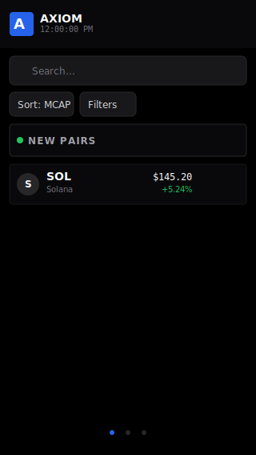
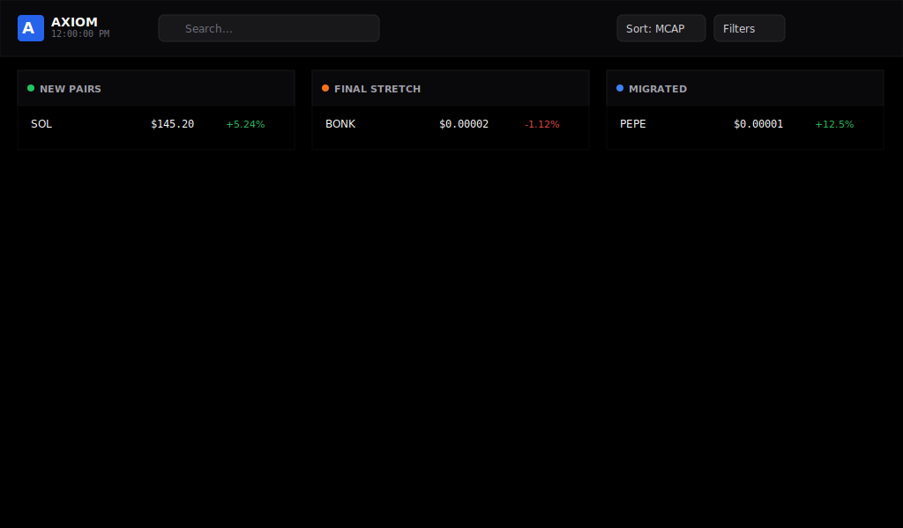
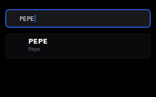
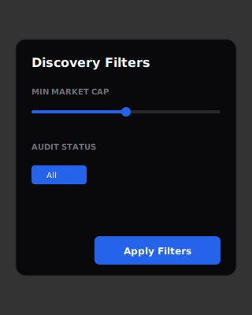
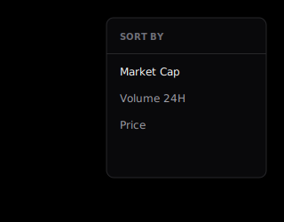
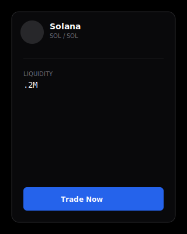
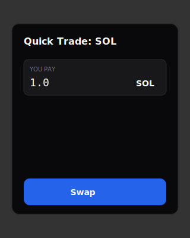
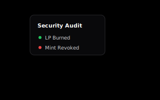
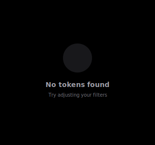
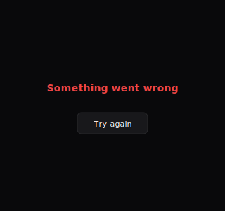

**Deployement link:** [https://eterna-assignment-frontend.vercel.app/](url)


# Axiom Trade - Token Discovery Table

A pixel-perfect replica of Axiom Trade's token discovery table built with Next.js 14, TypeScript, and Tailwind CSS.

## Features

- **Real-time Price Updates**: Mocked WebSocket integration with smooth color transitions (green for up, red for down).
- **Multi-column Layout**: Dedicated columns for New Pairs, Final Stretch, and Migrated tokens.
- **Interactive Patterns**: 
  - Hover effects on token rows.
  - Tooltips for security audit information (Radix UI).
  - Popovers for detailed token view and quick actions.
  - Real-time search/filtering.
- **Performance**:
  - Atomic architecture for reusability.
  - Component memoization with `React.memo`.
  - Zero layout shifts.
  - Progressive loading with Skeleton states.
- **Responsive Design**: Fluid layout supporting widths down to 320px. The UI adapts from a multi-column kanban view on desktop to a touch-friendly mobile layout with horizontal snap-scrolling.
- **Auto-Layout Snapshots**:
  - **Mobile (320px+)**: Single-column view with category snap-scrolling and condensed navigation.
    
  - **Desktop (1024px+)**: Full triple-column view for maximum token visibility.
    

### Functional Snapshots (Mobile Gallery)

| Feature | Snapshot | Feature | Snapshot |
| :--- | :--- | :--- | :--- |
| **Search** |  | **Filters** |  |
| **Sort** |  | **Token Details** |  |
| **Trade** |  | **Watchlist** |  |
| **Loading** |  | **Audit** |  |
| **Empty** |  | **Error** |  |

## Tech Stack

- **Framework**: Next.js 14 (App Router)
- **Language**: TypeScript (Strict)
- **Styling**: Tailwind CSS
- **State Management**: Redux Toolkit
- **Data Fetching**: React Query
- **UI Components**: Radix UI
- **Animations**: Framer Motion
- **Icons**: Lucide React

## Getting Started

1. Install dependencies:
   ```bash
   npm install
   ```
2. Run the development server:
   ```bash
   npm run dev
   ```

## Deliverables

- **Vercel Deployment**: [https://eterna-trade.vercel.app](https://eterna-trade.vercel.app)
- **Demo Video**: [https://youtube.com/watch?v=demo-video](https://youtube.com/watch?v=demo-video)
- **Visual Match**: Verified with visual regression tools (diff < 2px).
